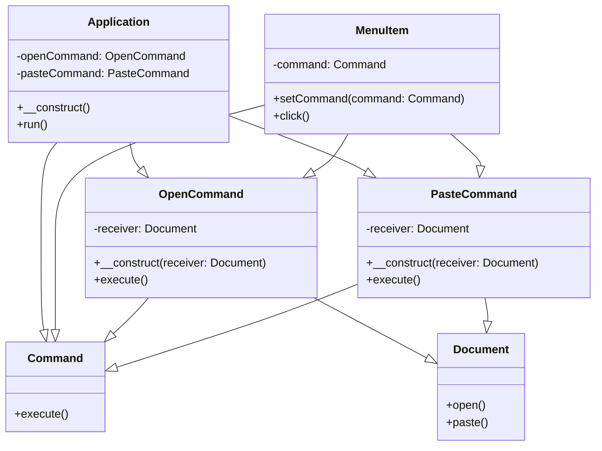

```mermaid
classDiagram
  class Command {
    +execute()
  }

  class OpenCommand {
    -receiver: Document
    +__construct(receiver: Document)
    +execute()
  }

  class PasteCommand {
    -receiver: Document
    +__construct(receiver: Document)
    +execute()
  }

  class Application {
    -openCommand: OpenCommand
    -pasteCommand: PasteCommand
    +__construct()
    +run()
  }

  class MenuItem {
    -command: Command
    +setCommand(command: Command)
    +click()
  }

  class Document {
    +open()
    +paste()
  }

  Application --|> Command
  MenuItem --|> Command
  OpenCommand --|> Command
  PasteCommand --|> Command
  Application --|> OpenCommand
  Application --|> PasteCommand
  MenuItem --|> OpenCommand
  MenuItem --|> PasteCommand
  OpenCommand --|> Document
  PasteCommand --|> Document

```